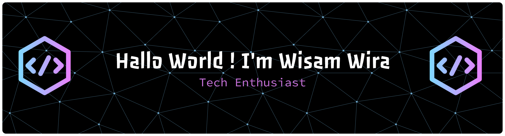

<h1 align="center">Holla  Wisam Here!</h1>

  Informatics Student • AI Enthusiast •  Problem Solver

---

---
<picture>
  <source media="(prefers-color-scheme: dark)" srcset="https://raw.githubusercontent.com/wisamWR/wisamWR/output/pacman-contribution-graph-dark.svg">
  <source media="(prefers-color-scheme: light)" srcset="https://raw.githubusercontent.com/wisamWR/wisamWR/output/pacman-contribution-graph.svg">
  
</picture>

